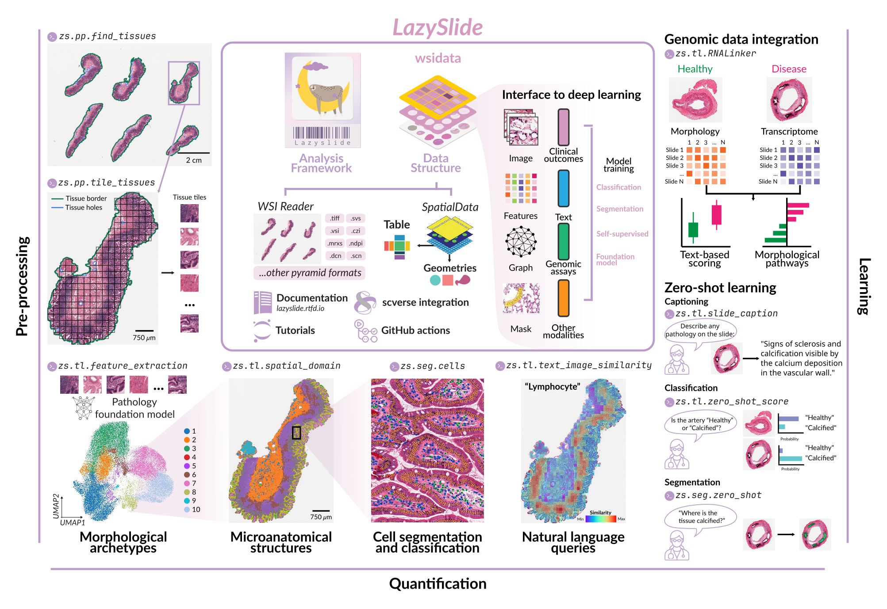

# LazySlide

<p align="center">
    <picture align="center">
    
    </picture>
</p>
<p align="center">
  <i>Accessible and interoperable whole slide image analysis</i>
</p>

[](https://doi.org/10.1101/2025.05.28.656548) ⬅️ read the preprint on BioRxiv

[](https://lazyslide.readthedocs.io/en/stable)


![scverse ecosystem](https://img.shields.io/badge/scverse_ecosystem-gray.svg?style=flat-square&logo=data:image/svg+xml;base64,PD94bWwgdmVyc2lvbj0iMS4wIiBlbmNvZGluZz0iVVRGLTgiIHN0YW5kYWxvbmU9Im5vIj8+PCFET0NUWVBFIHN2ZyBQVUJMSUMgIi0vL1czQy8vRFREIFNWRyAxLjEvL0VOIiAiaHR0cDovL3d3dy53My5vcmcvR3JhcGhpY3MvU1ZHLzEuMS9EVEQvc3ZnMTEuZHRkIj4KPHN2ZyB3aWR0aD0iMTAwJSIgaGVpZ2h0PSIxMDAlIiB2aWV3Qm94PSIwIDAgOTEgOTEiIHZlcnNpb249IjEuMSIKICAgIHhtbG5zPSJodHRwOi8vd3d3LnczLm9yZy8yMDAwL3N2ZyIKICAgIHhtbG5zOnhsaW5rPSJodHRwOi8vd3d3LnczLm9yZy8xOTk5L3hsaW5rIiB4bWw6c3BhY2U9InByZXNlcnZlIgogICAgeG1sbnM6c2VyaWY9Imh0dHA6Ly93d3cuc2VyaWYuY29tLyIgc3R5bGU9ImZpbGwtcnVsZTpldmVub2RkO2NsaXAtcnVsZTpldmVub2RkO3N0cm9rZS1saW5lam9pbjpyb3VuZDtzdHJva2UtbWl0ZXJsaW1pdDoyOyI+CiAgICA8ZyBpZD0iRWJlbmVfMyI+CiAgICAgICAgPGc+CiAgICAgICAgICAgIDxwYXRoIGQ9Ik0zNSw4OS42Yy0yMi4zLC0zLjQgLTMwLjYsLTE5LjggLTMwLjYsLTE5LjhjMTAuOCwxNi45IDQzLDkuMSA1Mi45LDIuNWMxMi40LC04LjMgOCwtMTUuMyA2LjgsLTE4LjFjNS40LDcuMiA1LjMsMjMuNSAtMS4xLDI5LjRjLTUuNiw1LjEgLTE1LjMsNy45IC0yOCw2WiIgc3R5bGU9ImZpbGw6I2ZmZjtmaWxsLXJ1bGU6bm9uemVybztzdHJva2U6IzAwMDtzdHJva2Utd2lkdGg6MXB4OyIvPgogICAgICAgICAgICA8cGF0aCBkPSJNODMuOSw0My41YzIuOSwtNy4xIDAuOCwtMTIuNSAwLjUsLTEzLjNjLTAuNywtMS4zIC0xLjUsLTIuMyAtMi40LC0zLjFjLTE2LjEsLTEyLjYgLTU1LjksMSAtNzAuOSwxNi44Yy0xMC45LDExLjUgLTEwLjEsMjAgLTYuNywyNS44YzMuMSw0LjggNy45LDcuNiAxMy40LDljLTExLjUsLTEyLjQgOS44LC0zMS4xIDI5LC0zOGMyMSwtNy41IDMyLjUsLTMgMzcuMSwyLjhaIiBzdHlsZT0iZmlsbDojMzQzNDM0O2ZpbGwtcnVsZTpub256ZXJvO3N0cm9rZTojMDAwO3N0cm9rZS13aWR0aDoxcHg7Ii8+CiAgICAgICAgICAgIDxwYXRoIGQ9Ik03OS42LDUwLjRjOSwtMTAuNSA1LC0xOS43IDQuOCwtMjAuNGMtMCwwIDQuNCw3LjEgMi4yLDIyLjZjLTEuMiw4LjUgLTUuNCwxNiAtMTAuMSwxMS44Yy0yLjEsLTEuOCAtMywtNi45IDMuMSwtMTRaIiBzdHlsZT0iZmlsbDojZmZmO2ZpbGwtcnVsZTpub256ZXJvO3N0cm9rZTojMDAwO3N0cm9rZS13aWR0aDoxcHg7Ii8+CiAgICAgICAgICAgIDxwYXRoIGQ9Ik02NCw1NC4yYy0zLjMsLTQuOCAtOC4xLC03LjQgLTEyLjMsLTEwLjhjLTIuMiwtMS43IC0xNi40LC0xMS4yIC0xOS4yLC0xNS4xYy02LjQsLTYuNCAtOS41LC0xNi45IC0zLjQsLTIzLjFjLTQuNCwtMC44IC04LjIsMC4yIC0xMC42LDEuNWMtMS4xLDAuNiAtMi4xLDEuMiAtMi44LDJjLTYuNyw2LjIgLTUuOCwxNyAtMS42LDI0LjNjNC41LDcuOCAxMy4yLDE1LjQgMjQuMywyMi44YzUuMSwzLjQgMTUuNiw4LjQgMTkuMywxNmMxMS43LC04LjEgNy42LC0xNC45IDYuMywtMTcuNloiIHN0eWxlPSJmaWxsOiNiNGI0YjQ7ZmlsbC1ydWxlOm5vbnplcm87c3Ryb2tlOiMwMDA7c3Ryb2tlLXdpZHRoOjFweDsiLz4KICAgICAgICAgICAgPHBhdGggZD0iTTM4LjcsOS44YzcuOSw2LjMgMTIuNCw5LjggMjAsOC41YzUuNywtMSA0LjksLTcuOSAtNCwtMTMuNmMtNC40LC0yLjggLTkuNCwtNC4yIC0xNS43LC00LjJjLTcuNSwtMCAtMTYuMywzLjkgLTIwLjYsNi40YzQsLTIuMyAxMS45LC0zLjggMjAuMywyLjlaIiBzdHlsZT0iZmlsbDojZmZmO2ZpbGwtcnVsZTpub256ZXJvO3N0cm9rZTojMDAwO3N0cm9rZS13aWR0aDoxcHg7Ii8+CiAgICAgICAgPC9nPgogICAgPC9nPgo8L3N2Zz4=)

[Installation](https://lazyslide.readthedocs.io/en/stable/installation.html) | 
[Tutorials](https://lazyslide.readthedocs.io/en/stable/tutorials/index.html) |
[Preprint](https://doi.org/10.1101/2025.05.28.656548)

LazySlide is a Python framework for whole slide image (WSI) analysis, designed to integrate seamlessly with the scverse
ecosystem.

By adopting standardized data structures and APIs familiar to the single-cell and genomics community, LazySlide enables
intuitive, interoperable, and reproducible workflows for histological analysis. It supports a range of tasks from basic
preprocessing to advanced deep learning applications, facilitating the integration of histopathology into modern
computational biology.

<p align="center">
  
</p>
<p align="left">
  💬 We warmly welcome contributions for <strong>documentation</strong>, 
<strong>tests</strong>, or even <strong>suggestions</strong> on what to add!
Start by submitting an issue or pull request!
</p>


## Key features

- **Interoperability**: Built on top of SpatialData, ensuring compatibility with scverse tools like scanpy, anndata, and
  squidpy.
- **Accessibility**: User-friendly APIs that cater to both beginners and experts in digital pathology.
- **Scalability**: Efficient handling of large WSIs, enabling high-throughput analyses.
- **Multimodal integration**: Combine histological data with transcriptomics, genomics, and textual annotations.
- **Foundation model support**: Native integration with state-of-the-art models (e.g., UNI, CONCH, Gigapath, Virchow)
  for tasks like zero-shot classification and captioning.
- **Deep learning ready**: Provides PyTorch dataloaders for seamless integration into machine learning pipelines.​



## Documentation

Comprehensive documentation is available at [https://lazyslide.readthedocs.io](https://lazyslide.readthedocs.io). It
includes tutorials, API references, and guides to help you get started.​

## System requirements

LazySlide has been tested from Python 3.11 to 3.13 (with GitHub Action) on Windows, Linux, and MacOS.
Version for dependencies is usually flexible, for the specific version used in development, 
please see `pyproject.toml` and `uv.lock`.

## Installation

Lazyslide is available at the [PyPI](https://pypi.org/project/lazyslide). This means that you can get it with your
favourite package manager:

- `pip install lazyslide` or
- `uv add lazyslide`

A typical installation time on a MacBook Pro with `uv` takes ~4s.

For full instructions, please refer to
the [Installation page in the documentation](https://lazyslide.readthedocs.io/en/stable/installation.html).

## Quick start

With a few lines of code, you can quickly run process a whole slide image (tissue segmentation, tesselation, feature
extraction) (~7s on a MacBook Pro):

```python
import lazyslide as zs

wsi = zs.datasets.sample()

# Pipeline
zs.pp.find_tissues(wsi)
zs.pp.tile_tissues(wsi, tile_px=256, mpp=0.5)
zs.tl.feature_extraction(wsi, model='resnet50')

# Access the features
features = wsi['resnet50_tiles']

# Visualize the 1st and 99th features
zs.pl.tiles(wsi, feature_key="resnet50", color=["1", "99"])
```

To use your slide file

```python
from wsidata import open_wsi

wsi = open_wsi("path_to_slide")
```

## Contributing

We welcome contributions from the community. Please refer to our 
[contributing guide](https://lazyslide.readthedocs.io/en/latest/contributing/index.html) for guidelines on how to contribute.

## Licence

LazySlide is released under the [MIT License](LICENCE).
